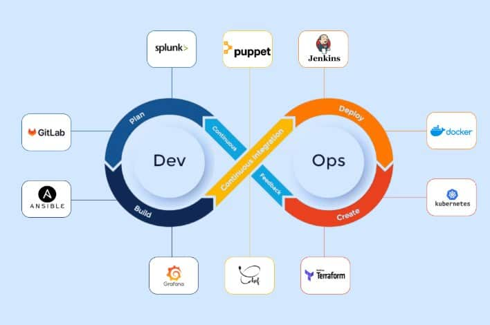
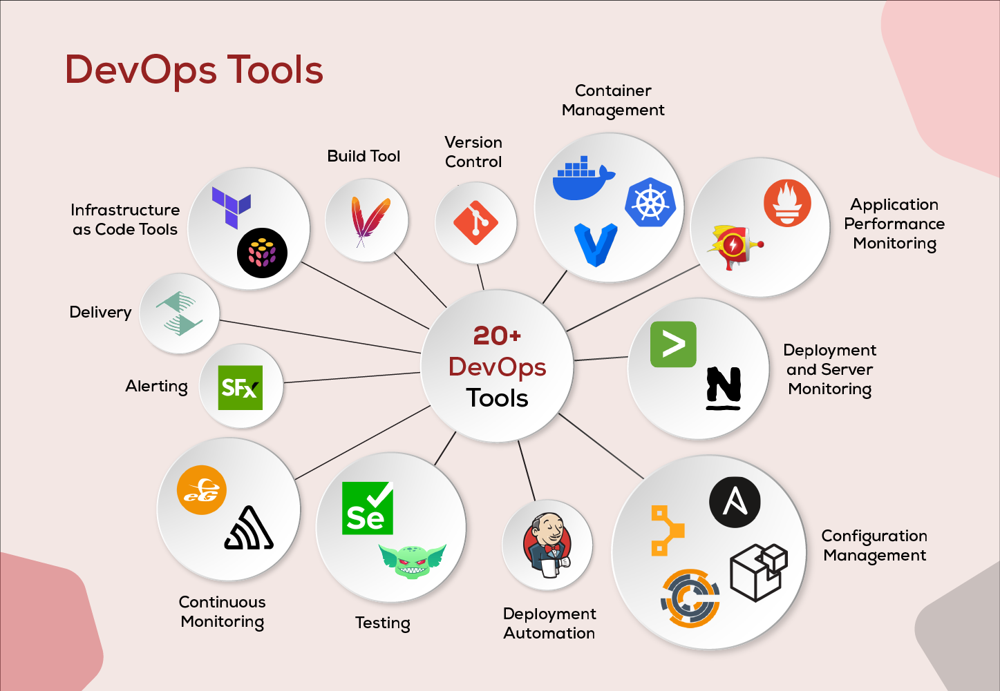

### What is DevOps?

DevOps is a cultural and technical approach that brings together two key teams in software creation: **developers** (who write the code for applications) and **operations** (who manage the servers, deployments, and ongoing maintenance). The term "DevOps" is a mashup of "Development" and "Operations." At its core, DevOps is about breaking down silos between these groups to make the process of building, testing, deploying, and running software faster, more reliable, and more collaborative.

Imagine you're building a website. In a traditional setup, developers might code the site and then "throw it over the wall" to operations to deploy it. This often leads to delays, miscommunications, and bugs because the teams aren't aligned. DevOps changes that by encouraging everyone to work together from the start, using automation tools to handle repetitive tasks. It's like turning software delivery into a smooth assembly line instead of a bumpy road.

#### Why is DevOps Important?
- **Faster Delivery:** In today's world, companies like Netflix or Amazon release updates multiple times a day. DevOps enables "continuous integration" and "continuous delivery" (CI/CD), so changes go live quickly without breaking things.
- **Better Collaboration:** It fosters a culture where devs and ops share responsibility, reducing blame games and improving team morale.
- **Fewer Errors:** Automation catches issues early, leading to more stable software and less downtime.
- **Scalability and Efficiency:** As your web app grows, DevOps helps handle more users without manual hassle, saving time and money.
- **Competitive Edge:** Businesses adopting DevOps can innovate faster, respond to user feedback quickly, and stay ahead in a tech-driven market.
- **Security Integration:** Modern DevOps includes "DevSecOps," where security is baked in from the beginning, reducing risks like data breaches.

If you're a web developer with no prior knowledge, think of DevOps as the "ops" side of your dev skills—it's what turns your code into a live, reliable product. Learning it will make you a full-stack powerhouse, able to handle everything from coding to deployment.

### Overview of Tools, Programming Languages, Software, and Technologies in DevOps

DevOps isn't about one tool or language; it's a ecosystem. You'll use **programming languages** for scripting automation, **tools** for specific tasks like building or monitoring, **software** like platforms for hosting, and **technologies** like containers for packaging apps.

#### Key Programming Languages in DevOps
These are used for writing scripts to automate tasks, configure systems, or build tools. You don't need to be an expert in all, but starting with one scripting language is key.
- **Python:** Beginner-friendly, versatile for automation, data analysis, and building DevOps tools. Used in scripts for CI/CD pipelines or infrastructure management.
- **Bash/Shell Scripting:** For quick commands on Linux/Unix systems (common in servers). Essential for automating server tasks like backups or deployments.
- **Go (Golang):** Efficient for building fast, reliable tools. Many DevOps tools (like Docker or Kubernetes) are written in Go.
- **JavaScript/Node.js:** If you're a web dev, this extends your skills to backend automation, like in serverless setups.
- **Others:** Ruby (for tools like Chef) or PowerShell (for Windows environments).

Start with Python or Bash if you're new—they're straightforward and widely used.

#### Core DevOps Technologies and Concepts
Before diving into tools, here's a high-level overview of key areas:
- **Version Control:** Tracking code changes.
- **CI/CD (Continuous Integration/Continuous Delivery):** Automating builds, tests, and deployments.
- **Infrastructure as Code (IaC):** Treating servers like code for easy management.
- **Containerization:** Packaging apps in isolated environments.
- **Orchestration:** Managing multiple containers at scale.
- **Monitoring and Logging:** Watching apps for issues.
- **Cloud Computing:** Hosting everything on scalable platforms.
- **Configuration Management:** Automating server setups.

Now, let's focus on the most widely used tools. I'll organize them into categories with a list, then provide detailed explanations for each major one. This is based on industry standards (e.g., from surveys like the State of DevOps Report). Tools like Git, Docker, and Kubernetes top the charts for adoption.

### Organized List of Major DevOps Tools and Technologies

Here's a categorized list of the most popular ones (focusing on open-source and widely adopted). I've prioritized essentials for beginners.

1. **Version Control**
   - Git (with platforms like GitHub, GitLab, Bitbucket)

2. **CI/CD Pipelines**
   - Jenkins
   - GitHub Actions
   - GitLab CI/CD
   - CircleCI

3. **Configuration Management**
   - Ansible
   - Puppet
   - Chef

4. **Containerization**
   - Docker

5. **Orchestration**
   - Kubernetes (often abbreviated as K8s)
   - Docker Swarm (simpler alternative)

6. **Infrastructure as Code (IaC)**
   - Terraform
   - AWS CloudFormation (cloud-specific)

7. **Monitoring and Logging**
   - Prometheus (for metrics)
   - Grafana (for visualization)
   - ELK Stack (Elasticsearch, Logstash, Kibana)

8. **Cloud Platforms**
   - Amazon Web Services (AWS)
   - Microsoft Azure
   - Google Cloud Platform (GCP)

9. **Collaboration and Other Tools**
   - Slack or Microsoft Teams (for communication)
   - Jira or Trello (for project tracking)
   - SonarQube (for code quality)

### Detailed Explanations of Major DevOps Tools

For each tool, I'll cover: **Purpose** (what it does), **How It's Used in Real-World Workflows** (step-by-step examples), and tips for beginners. These are the most widely used based on popularity in 2025.

#### 1. Git
- **Purpose:** Git is a version control system that tracks changes in code, allowing multiple people to collaborate without overwriting each other's work. It's the foundation of DevOps because everything starts with code management.
- **Real-World Workflows:** 
  - A team of web devs works on a project. You "clone" the repo from GitHub to your local machine.
  - Make changes (e.g., add a new feature), "commit" them with a message, and "push" to the remote repo.
  - Others "pull" updates. Use branches for features (e.g., create a "feature/login" branch), then merge via pull requests for review.
  - In DevOps, Git triggers CI/CD: A push to the main branch auto-builds and deploys your site.
- **Beginner Tip:** Install Git, sign up for GitHub, and practice with commands like `git init`, `git add`, `git commit`. It's free and essential—learn it first!

#### 2. Jenkins
- **Purpose:** Jenkins is an open-source automation server for building, testing, and deploying code automatically (CI/CD). It integrates with other tools to create pipelines.
- **Real-World Workflows:**
  - Set up a "pipeline" in a Jenkinsfile (written in Groovy or declarative syntax).
  - When you push code to Git, Jenkins detects it, builds the app (e.g., compiles JavaScript), runs tests (e.g., unit tests for your web app), and deploys to a server if tests pass.
  - Example: For a web app, Jenkins might build a Docker image, push it to a registry, and notify the team via Slack.
  - Used by companies like Netflix for massive-scale deployments.
- **Beginner Tip:** Start with the free version on your local machine. It's plugin-heavy, so add ones for Git or Docker.

#### 3. GitHub Actions
- **Purpose:** A CI/CD platform built into GitHub, making it easy to automate workflows directly in your repo without a separate server.
- **Real-World Workflows:**
  - Create a YAML file (e.g., `.github/workflows/ci.yml`) defining steps like "build," "test," "deploy."
  - On a code push or pull request, it runs automatically: e.g., tests your Node.js app, deploys to AWS if approved.
  - Integrates seamlessly with GitHub—great for web devs already using it.
  - Real example: Open-source projects use it to auto-release new versions.
- **Beginner Tip:** If you're on GitHub, this is the easiest CI/CD to start with. Free for public repos.

#### 4. Ansible
- **Purpose:** An agentless configuration management tool that automates server setup, app deployment, and orchestration using simple YAML files (called playbooks).
- **Real-World Workflows:**
  - Write a playbook to install software (e.g., set up Nginx on multiple servers).
  - Run it via SSH—no need for agents on target machines.
  - In a workflow: After CI builds your app, Ansible deploys it to production servers, configures databases, and rolls back if needed.
  - Used in enterprises for managing hundreds of servers without manual logins.
- **Beginner Tip:** Python-based, so easy if you know Python. Start with local playbooks for practice.

#### 5. Docker
- **Purpose:** Containerization tool that packages your app and its dependencies into a "container"—a lightweight, portable unit that runs consistently anywhere (local, cloud, etc.).
- **Real-World Workflows:**
  - Write a Dockerfile defining your app's environment (e.g., Node.js, dependencies).
  - Build an image: `docker build -t myapp .`
  - Run it: `docker run myapp`—it spins up instantly.
  - In DevOps: Push images to Docker Hub, then deploy via CI/CD to Kubernetes. Ensures "it works on my machine" isn't an issue.
  - Example: Web apps like WordPress are often containerized for easy scaling.
- **Beginner Tip:** Install Docker Desktop. It's revolutionary—learn containers early.

#### 6. Kubernetes
- **Purpose:** An orchestration platform for managing clusters of containers at scale, handling deployment, scaling, and failover automatically.
- **Real-World Workflows:**
  - Define deployments in YAML (e.g., run 3 replicas of your Dockerized web app).
  - Kubernetes schedules them across nodes, auto-scales based on traffic, and restarts failed ones.
  - Integrated with CI/CD: Jenkins deploys to K8s clusters on AWS.
  - Used by Google, Spotify for handling millions of users.
- **Beginner Tip:** Start with Minikube (local K8s). It's complex, so learn after Docker.

#### 7. Terraform
- **Purpose:** IaC tool for provisioning and managing infrastructure (servers, networks) as code, supporting multiple clouds.
- **Real-World Workflows:**
  - Write HCL files (e.g., create an AWS EC2 instance).
  - Run `terraform apply` to build it; `terraform destroy` to tear down.
  - In workflows: Version-control infra changes, integrate with CI for auto-provisioning.
  - Example: Set up a full web stack (DB, server, load balancer) in one go.
- **Beginner Tip:** Great for multi-cloud. Free and declarative.

#### 8. Prometheus + Grafana
- **Purpose:** Prometheus collects metrics (e.g., CPU usage); Grafana visualizes them in dashboards.
- **Real-World Workflows:**
  - Install on your cluster; Prometheus scrapes data from apps.
  - Set alerts (e.g., email if site is down).
  - Grafana creates graphs: Monitor your web app's performance post-deployment.
  - Used together for proactive issue spotting in production.
- **Beginner Tip:** Start with Prometheus for basics, add Grafana for pretty dashboards.

#### 9. ELK Stack
- **Purpose:** Elasticsearch (search/storage), Logstash (processing), Kibana (visualization) for centralized logging.
- **Real-World Workflows:**
  - Apps send logs to Logstash, which filters and stores in Elasticsearch.
  - Query in Kibana: Debug errors in your deployed web app.
  - Example: Trace a bug from user report to code line.
- **Beginner Tip:** Now often called Elastic Stack. Useful for troubleshooting.

#### 10. AWS (Amazon Web Services)
- **Purpose:** A cloud platform providing services like EC2 (virtual servers), S3 (storage), and Lambda (serverless).
- **Real-World Workflows:**
  - Host your web app on EC2, store files in S3.
  - Integrate with DevOps tools: Use for CI/CD, auto-scaling.
  - Example: Deploy via Terraform, monitor with CloudWatch.
- **Beginner Tip:** Free tier available. Similar for Azure/GCP—pick one cloud to start.

This covers the essentials. As a motivated beginner, start hands-on: Set up Git, Docker, and a simple CI pipeline. Resources like freeCodeCamp or AWS tutorials are great. DevOps evolves, so practice on personal projects! If you have questions on any tool, ask.

# Devlopment Operation (DevOps):
### Expanded and Updated Organized List of Major DevOps Tools and Technologies (2025)

Here's an **expanded categorized list** of the most popular and widely adopted DevOps tools in 2025. This is based on current industry trends, adoption rates from reports (e.g., DORA State of DevOps, job market data, and surveys), and real-world usage. I've included the essentials from before, plus additional highly mentioned tools like Helm, ArgoCD, Pulumi, and others that are rising in popularity (e.g., for GitOps, multi-cloud IaC, and security).

The focus remains on open-source and widely used ones, prioritized for beginners to advanced users.

1. **Version Control**
   - Git (core system)
   - Platforms: GitHub, GitLab, Bitbucket

2. **CI/CD Pipelines**
   - Jenkins
   - GitHub Actions
   - GitLab CI/CD
   - CircleCI
   - ArgoCD (for GitOps deployments)
   - Azure DevOps / AWS CodePipeline (cloud-native)

3. **Build Tools**
   - Maven
   - Gradle

4. **Configuration Management**
   - Ansible
   - Puppet
   - Chef

5. **Infrastructure as Code (IaC)**
   - Terraform (most popular)
   - Pulumi (code-based IaC)
   - AWS CloudFormation
   - OpenTofu (Terraform fork)

6. **Containerization**
   - Docker

7. **Orchestration and Container Management**
   - Kubernetes (K8s – dominant standard)
   - Helm (Kubernetes package manager)
   - Docker Swarm (simpler alternative)

8. **Monitoring, Logging, and Observability**
   - Prometheus (metrics collection)
   - Grafana (dashboards and visualization)
   - ELK Stack (Elasticsearch, Logstash, Kibana) or Elastic Stack
   - Splunk (enterprise logging)
   - OpenTelemetry (tracing standard)

9. **Testing and Quality**
   - Selenium (automated testing)
   - SonarQube (code quality and security scans)

10. **Security (DevSecOps)**
    - Trivy (vulnerability scanning)
    - Aqua Security (container security)

11. **Cloud Platforms**
    - Amazon Web Services (AWS)
    - Microsoft Azure
    - Google Cloud Platform (GCP)

12. **Collaboration and Project Management**
    - Slack / Microsoft Teams (communication)
    - Jira / Trello (issue tracking and Agile planning)
    

**Visual: Top DevOps Tools Overview (2025 Diagram)**  
This diagram illustrates a comprehensive landscape of DevOps tools across the pipeline.

**Visual: DevOps Tools Lifecycle Infographic**  
A categorized view of tools in the DevOps lifecycle.

**Visual: Ultimate Guide to Top DevOps Tools**  
An infographic highlighting key tools and their roles.

### Alphabetical (A-Z) List of Commonly Used DevOps Tools

For a complete A-to-Z reference, here's a sorted list of major tools mentioned across categories (focusing on the most popular ones in 2025):

- Ansible
- ArgoCD
- Aqua Security
- AWS (Amazon Web Services) / AWS CloudFormation / AWS CodePipeline
- Azure (Microsoft Azure) / Azure DevOps
- Bitbucket
- Chef
- CircleCI
- Docker / Docker Swarm
- ELK Stack (Elasticsearch, Logstash, Kibana)
- Git / GitHub / GitLab / GitLab CI/CD
- Google Cloud Platform (GCP)
- Gradle
- Grafana
- Helm
- Jenkins
- Jira
- Kubernetes (K8s)
- Maven
- OpenTelemetry
- Prometheus
- Pulumi
- Puppet
- Selenium
- Slack / Microsoft Teams
- SonarQube
- Splunk
- Terraform / OpenTofu
- Trivy
- Trello

This isn't exhaustive (DevOps has hundreds of niche tools), but these cover ~90% of what you'll encounter in jobs, projects, and pipelines in 2025. Trends show a shift toward GitOps (ArgoCD/Helm), multi-cloud IaC (Pulumi/Terraform), and integrated observability (Prometheus + Grafana + OpenTelemetry).

If you'd like details on any new tool, a learning path, or comparisons (e.g., Terraform vs. Pulumi), just let me know!

